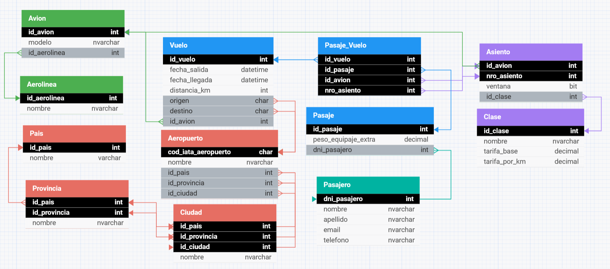

# PRESENTACIÓN - Reserva de pasajes aéreos

**Asignatura**: Bases de Datos I (FaCENA-UNNE)

**Integrantes**:
- Benitez, Gonzalo Ezequiel 
- Centurión, Esteban Agustín 
- Marquez, Marcos Abel 
- Risso, Santiago Francisco
  
**Año**: 2024

# CAPÍTULO I: INTRODUCCIÓN

## Caso de Estudio

El proyecto se centra en la creación de un base de datos para la gestión de reservas de pasajes aéreos en línea. Se mantendrá un registro de los pasajeros, los aviones y los vuelos. Se busca ofrecer una solución integral para la gestión de reservas de vuelos, abordando aspectos como la disponibilidad de asientos, la selección de clases, los precios de pasajes y la asignación de asientos. No se trata de un sistema interno para el personal de un aeropuerto, sino de un sistema de reservas de pasajes aéreos dirigido a los clientes con acceso mediante una pagina web.

### Alcance:</ins>

 **Se incluye:**
 
 - Gestión de ubicaciones: Representación de ciudades, provincias y países.
 - Gestión de infraestructura del aeropuerto: Almacena información sobre los aeropuertos y su 
 ubicación geográfica.
 - Gestión de aerolíneas y aviones: Cada aerolínea puede tener múltiples aviones asignados.
 - Gestión de vuelos: Detalla información sobre los vuelos, incluyendo origen, destino, fechas y el 
 avión utilizado.
 - Gestion de pasajes: Cada pasaje puede tener varios vuelos (vuelos con escala).
 - Gestión de pasajeros: Registra los datos de los pasajeros.
 - Asignación de asientos y clase: Permite definir asientos específicos y su clase en cada 
 vuelo.

**Fuera del alcance del proyecto quedan:**

- La gestión interna del aeropuerto, como la administración del personal y la planificación de mantenimiento de aviones.
- Registro de pago y el tipo de pago.
- Gestion de cuentas de usuarios (los pasajeros no tendran un campo que almacene contraseña).

## Definición o planteamiento del problema

En el contexto actual, donde el tráfico aéreo sigue en aumento y los usuarios demandan servicios rápidos y efectivos, muchas aerolíneas enfrentan desafíos en la gestión de sus reservas. Problemas como la sobreventa de asientos, la falta de sincronización en los registros de vuelo y las dificultades en la asignación de asientos afectan tanto a la satisfacción del cliente como a la operatividad de la aerolínea. Este Trabajo Práctico se plantea como una oportunidad para explorar y desarrollar un sistema de reservas capaz de manejar eficientemente estos aspectos, respondiendo a preguntas como:

- ¿Cómo garantizar una correcta asignación de asientos en tiempo real?
- ¿De qué manera optimizar la gestión de pasajes para evitar sobreventas?
- ¿Cómo mejorar la experiencia de los usuarios en el proceso de reserva? 

## Objetivo del Proyecto

### Objetivos Generales:

- Diseñar una base de datos para reservas de pasajes aéreos manteniendo las relaciones y restricciones de acuerdo al alcance definido anteriormente. 
- Insertar un lote de datos con representativo que mantega coherencia con la definicion de tablas.
- Aplicar los 4 temas obligatorios:
   1) Manejo de permisos a nivel de usuarios de base de datos.
   2) Procedimientos y funciones almacenadas.
   3) Optimización de consultas a través de índices.
   3) Vistas y Vistas indexadas.
- Realizar consultas especificas sobre los datos.

### Objetivos Especificos:

<ins> Restriciones:	<ins>
- El email del pasajero debe ser unico.
- El telefono del pasajero es opcional.
- El equipaje extra es opcional.
- Precio de tarifa, distancia(km), peso del equipaje deben ser numeros decimales positivos.
- Fecha de llegada debe ser mayor que fecha de salida en un vuelo.
- DNI de pasajero debe ser un numero de 8 digitos como maximo.

<ins> Manejo de permisos a nivel de usuarios de base de datos: <ins>
- Entender el manejo de permisos y roles en bases de datos.
- Aplicar permisos de lectura, escritura y ejecución para diferentes roles y usuarios.

<ins> Procedimientos y funciones almacenadas: <ins>
- Comprender la diferencia entre procedimientos y funciones almacenadas.
- Aplicar procedimientos y funciones en la implementación de operaciones CRUD.

<ins> Optimización de consultas a través de índices: <ins>
- Conocer los tipos de índices y sus aplicaciones.
- Evaluar el impacto de los índices en el rendimiento de las consultas.

<ins>Vistas y Vistas indexadas: <ins>
- Comprender el uso de vistas y vistas indexadas para mejorar la gestión y consulta de datos.
- Evaluar el impacto de las vistas indexadas en el rendimiento de las consultas.

# CAPITULO II: MARCO CONCEPTUAL O REFERENCIAL

## TEMA 1 - Manejo de permisos a nivel de usuarios de base de datos 

El manejo de permisos a nivel de usuarios en bases de datos es una práctica fundamental en la administración de sistemas de información, ya que permite controlar el acceso y las acciones que cada usuario puede realizar sobre los datos. En sistemas de bases de datos relacionales (RDBMS), como Microsoft SQL Server, existen herramientas específicas para definir roles y permisos. Este tema es clave para garantizar la seguridad, confidencialidad y eficiencia en la operación de la base de datos, particularmente en entornos que requieren un control estricto de la información sensible.

 Objetivo del Manejo de Permisos
El manejo de permisos permite definir los derechos de acceso que cada usuario o grupo de usuarios tiene sobre la base de datos. Los permisos son reglas que controlan las acciones, tales como lectura, escritura y ejecución de comandos específicos. La asignación adecuada de permisos asegura que cada usuario pueda acceder únicamente a los datos y funciones necesarias para su rol, minimizando el riesgo de errores accidentales y de accesos no autorizados.

 Roles y Usuarios en Bases de Datos
En un sistema de base de datos, un rol es un conjunto de permisos que puede ser asignado a múltiples usuarios. Esto simplifica la administración de permisos, permitiendo que usuarios con roles similares (como “lectores” o “administradores”) compartan permisos comunes. En contraste, un usuario es una cuenta específica creada en la base de datos que puede tener permisos individuales o pertenecer a uno o varios roles.

Roles de lectura (solo lectura) permiten ver los datos sin realizar modificaciones.
Roles de escritura permiten modificar datos, por ejemplo, insertando o actualizando registros.
Roles de ejecución autorizan la ejecución de procedimientos almacenados y otras operaciones.
 Implementación de Permisos
Los permisos pueden asignarse tanto a nivel de usuarios individuales como de roles. Esto se realiza mediante comandos de control de acceso como GRANT y REVOKE. En la práctica, los permisos a nivel de usuarios se utilizan para otorgar acceso a un usuario específico, mientras que los permisos a nivel de roles son útiles para implementar políticas de acceso a nivel grupal.

En el escenario donde se gestiona la reserva de pasajes aéreos, un administrador de base de datos podría:
Crear un rol RolSoloLectura que permita a los usuarios visualizar la información en tablas sensibles, como las de Pasaje y Pasajero, sin poder modificarlas.
Asignar a los usuarios en roles específicos para asegurar que solo ciertos usuarios puedan ejecutar procedimientos almacenados que alteran los datos, mientras que otros solo pueden visualizar información.
 Pruebas y Evaluación de Permisos
Una buena práctica en la administración de permisos incluye pruebas regulares para verificar que los usuarios solo pueden acceder a las áreas que les corresponden. Esto implica:

Verificación de acceso: Probar que los usuarios con permisos de solo lectura pueden realizar consultas SELECT pero no pueden modificar datos.
Pruebas de restricciones: Asegurarse de que usuarios sin permisos específicos reciban mensajes de error cuando intentan acceder a datos o realizar operaciones restringidas.

 Conclusiones
 
El manejo de permisos es esencial para el funcionamiento seguro y ordenado de cualquier base de datos. Implementar y documentar adecuadamente los permisos garantiza que los datos están protegidos, se reduce la exposición a riesgos y se asegura que los usuarios trabajen dentro de un marco de acceso controlado. Esta práctica es indispensable en cualquier sistema que requiera precisión, privacidad y cumplimiento de regulaciones de seguridad de la información.

## TEMA 2 - Procedimientos y funciones almacenadas

<ins>Procedimientos Almacenados: <ins>

Son conjuntos de instrucciones SQL que se guardan en la base de datos para ejecutar operaciones repetitivas (consultas, actualizaciones) y pueden recibir parámetros. Los procedimientos pueden ser definidos por el usuario, temporales o del sistema.

Ventajas de los procedimientos almacenados:
- Rendimiento: Precompilados, se ejecutan más rápido, ya que SQL Server almacena el plan de ejecución.
- Reutilización y Mantenimiento: Código reutilizable en diferentes aplicaciones, cualquier cambio solo necesita realizarse en un lugar.
- Seguridad: Los permisos de acceso pueden ser asignados al procedimiento en lugar de a las tablas subyacentes.
- Reducción de tráfico de red: Se envía solo la llamada al procedimiento en lugar de una consulta extensa, se reduce la cantidad de datos que viajan entre el cliente y el servidor.

<ins>Funciones Almacenadas: <ins>

Bloques de código SQL que realizan una operación específica y devuelven un valor, diseñados para usarse en consultas (SELECT, WHERE, JOIN). Las funciones pueden ser definidas por el usuario o del sistema. Segun su retorno pueden ser funciones escalares (devuelve un valor unico) o funciones con valores de tabla (devuelve una tabla).

Ventajas de las funciones almacenadas:
- Rendimiento: Precompilados, se ejecutan más rápido, ya que SQL Server almacena el plan de ejecución.
- Reutilización y Mantenimiento: Código reutilizable en diferentes aplicaciones, cualquier cambio solo necesita realizarse en un lugar.
- Reducción de tráfico de red: Operaciones complejas en SELECT, WHERE, JOIN.

<ins>Diferencias:	<ins>

| Característica               | Procedimientos Almacenados                             | Funciones Almacenadas            |
|   :---:                      |     :---:                                              |       :---:                      |
| Retorno                      | Opcional, uno o mós                                    | Obligatorio, valor único o tabla |                     
| Puede usarse en `SELECT`     | No                                                     | Sí                               | 
| Modificación de datos        | Sí (`INSERT`, `UPDATE`, `DELETE`)                      | No                               |
| Transacciones                | Sí                                                     | No                               |
| Puede llamar al otro         | Puede llamar a una función                             | No puede llamar a un procedimiento|
| Propósito	                   | Lógica compleja y modificaciones de datos              | Cálculos y transformaciones      |

## TEMA 3 - Optimización de consultas a través de índices

<ins>Optimización de consultas: <ins>

La optimización de consultas a través de indices, es una herremienta muy conveniente usarlo a la hora de buscar una mejora notable en el tiempo de respuesta y, la recuperación de información de una base de datos. 
Pero para ello, los administradores de base de datos debemos tener un buen conocimiento de la estructura de ejecución de las consultas y cuándo es eficiente usar índices, ya que, pueden mejorar el rendimiento de las 
cláusulas SELECT, como también hacer más lentas las sentencias DML como INSERT,UPDATE,y DELETE.

<ins>Tipos de índices: <ins>

Existen varios tipos de índices que pueden ser utilizadas en función de nuestra necesidades, por ello nombraremos algunos de los índices que son mayormente usados.

- Índices Unicos: Creados para asegurar que nos existen valores duplicados y para mantener la integridad de la información de las columnas.
- Índices Agrupados: Son usados para almacenar las filas de información clasificadas basado en los valores clave. SQL Server nos permite crear un único índice por cada tabla.
- Índices No Agrupados: Utilizados para mejorar las consultas que son frecuentemente usadas, que no son cubiertas con los índces agrupados. Y a su vez, nos ayudan a mejorar el rendimiento del sistema.
- Índices Simples: Son creados sobre una sola columna, y nos permite acelarar la busqueda en base a esa columna especifica.
- Índices Complejos: Pueden ser creados en 2 o más columnas, son utiles para realizar búsquedasmás complejas que involucran varias condiciones en diferentes columnas.

 <ins>Beneficios de usar Índices: <ins>

  - Mejora el rendimiento de las consultas, especialmente en tablas que tienen un gran volumen de datos.
  - Reduce el tiempo de ejecución de las consultas.
  - Aceleran la búsqueda de los registros.
  - Acceden a los datos de una manera más optima.
  - Mejora la experencia de los usuarios

## TEMA 4 - Vistas y vistas indexadas
En SQL Server, una vista es un objeto de base de datos que representa un conjunto de datos que resulta de una consulta SQL almacenada. Las vistas actúan como una "ventana" que permite ver datos de una o más tablas sin tener que acceder directamente a ellas. Son particularmente útiles para:
  1.	Simplificar Consultas Complejas: Una vista puede almacenar consultas complejas, facilitando su reutilización y evitando que los usuarios tengan que escribirlas repetidamente.
  2.	Seguridad: Permiten limitar el acceso a ciertos datos sin exponer las tablas originales. Los usuarios pueden tener permisos para acceder a la vista, pero no necesariamente a las tablas subyacentes.
  3.	Mantenimiento de Datos: Al modificar una vista, los datos subyacentes pueden permanecer consistentes. Esto es útil si la estructura de las tablas cambia, ya que solo es necesario actualizar la vista, sin afectar las consultas de los usuarios.
  4.	Abstracción y Conveniencia: Al encapsular lógica compleja en una vista, se puede trabajar con datos de varias tablas como si fueran una sola entidad.

Ejemplo de Creación de Vista.
  create view VistaPasajerosActivos 
  select nombre, apellido, fecha_nacimiento, nuevo_pasaporte
  from Pasajero
  where estado = 'Activo';
En este ejemplo, muestra solo los pasajeros activos, seleccionando ciertas columnas de la tabla pasajero.

Vistas indexadas.
Ofrecen un rendimiento de lecturas mejorado al hacer uso del índice para leer los datos y no tener que ejecutar la consulta. Sin embargo, nos pueden llegar a penalizar considerablemente las operaciones de escritura al añadir no sólo otro índice donde escribir los datos sino complejidad a ese índice. Adicionalmente podremos crear tantos índices nonclustered sobre la vista como necesitemos. Al igual que ocurre con los índices de las tablas en nuestra mano queda medir el coste/beneficio y valorar su idoneidad.
Con las vistas indexadas notaremos una mejora en el rendimiento de nuestras consultas si las aplicamos sobre entornos con una gran diferencia de lecturas frente a escrituras, sobre todo entornos Data Warehouse, bases de datos OLAP o entornos de minería de datos. Rara vez serán recomendables en entornos con alta carga de transacciones IUD (insert, update y delete) en bases de datos OLTP.

Limitaciones.
Uno de los inconvenientes de las vistas indexadas es que la degradación en rendimiento de las escrituras es mayor que la mejora en las lecturas, esto nos limita en gran medida su uso. Sin embargo no es su única limitación, la verdad es que tienen una amplia lista de incompatibilidades y requisitos. Uno de los principales requisitos de las vistas indexadas es que hay que crearlas con la opción SCHEMABINDING esto implica que no se podrán modificar las tablas referenciadas.
Además de tener que crear la vista como SCHEMABINDING tenemos que tener en cuenta otros aspectos importantes:
  •	Las vistas indexadas no admiten expresiones no deterministas. Es decir, las expresiones de la vista siempre deben devolver el mismo resultado no como GETDATE() que nos devolvería un valor distinto en cada ejecución.
  •	Las tablas y funciones dentro de la vista deben declararse con el nombre completo (esquema.tabla).
  •	No se admiten subconsultas.
  •	No se admiten OUTER JOINS, esto deja fuera RIGHT JOIN y LEFT JOIN.
  •	El índice clustered de nuestra vista ocupará espacio en disco.
  •	Solo se puede hacer referencia a tablas de la misma base de datos.
  •	Si tenemos GROUP BY, la definición de la vista debe contener COUNT_BIG(*), pero no HAVING.
  •	No se puede usar EXISTS, NOT EXISTS, COUNT(*), MIN, MAX, hints de tablas, TOP ni UNION.
  •	No puede utilizar los tipos de datos text,  ntext ,  image o  XML. El tipo de datos float se puede utilizar en la vista, pero no en el índice agrupado.
  

# CAPÍTULO III: METODOLOGÍA SEGUIDA 

 **a) Cómo se realizó el Trabajo Práctico**

 **b) Herramientas (Instrumentos y procedimientos)**
 - [DB designer](https://www.dbdesigner.net/)
 - [SQL SERVER EXPRESS 22](https://www.microsoft.com/en-us/sql-server/sql-server-downloads)
 - [SQL Server Management Studio (SSMS) 20.2](https://learn.microsoft.com/es-es/sql/ssms/download-sql-server-management-studio-ssms?view=sql-server-ver16)

# CAPÍTULO IV: DESARROLLO DEL TEMA / PRESENTACIÓN DE RESULTADOS 

## Diagrama relacional

[Link a la pagina del diagrama](https://dbdesigner.page.link/zGxXPJzd4mikyFLP6)

## Diccionario de datos

Acceso al documento [PDF](doc/diccionario_datos_pasajes_aereos.pdf) del diccionario de datos.

## Script del modelo de datos
> Acceder a la siguiente carpeta  [scripts->script_ddl_pasajes_aereos.sql](script/script_ddl_pasajes_aereos.sql)

## Script de lote de datos
> Acceder a la siguiente carpeta  [scripts->script_insert_pasajes_aereos.sql](script/script_insert_pasajes_aereos.sql)

## Desarrollo TEMA 1 - Manejo de permisos a nivel de usuarios de base de datos

## Desarrollo TEMA 2 - Procedimientos y funciones almacenadas
> Documentación del script: [procedimientos_funciones_almacenadas.md](script/tema02_procedimientos_funciones/procedimientos_funciones.md)

> Script: [tema02_script.sql](script/tema02_procedimientos_funciones/tema02_script.sql)

## Desarrollo TEMA 3 - Optimización de consultas a través de índices
> Carga de 1 millón de registro: [1millon_de_pasajeros.sql](script/tema03_indices/1millon_de_pasajeros.sql)

## Desarrollo TEMA 4 - Vistas y vistas indexadas

# CAPÍTULO V: CONCLUSIONES

Tema 3: Optimización de consultas a través de índices

La implementación de índices, tanto agrupados como no agrupados, nos muestra que es una estrategia muy buena para mejora en el rendimiento de las consultas con grandes volúmenes de datos.

Las pruebas indican una la reducción en el tiempo de ejecución y en las lecturas lógicas considerable, lo que resulta en una mejora en la eficiencia general del sistema. 
Por lo tanto, es muy recomendable el uso de índices en bases de datos, para optimizar el acceso a los datos y mejorar la experiencia del usuario en aplicaciones que dependen de consultas rápidas.

# BIBLIOGRAFÍA DE CONSULTA

 1. [Documentación técnica oficial de SQL Server](https://learn.microsoft.com/es-es/sql/sql-server/?view=sql-server-ver16)
 2. List Item
 3. List item
 4. List item
 5. List item

