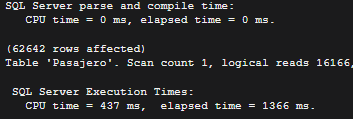
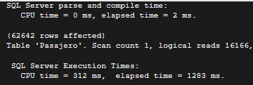
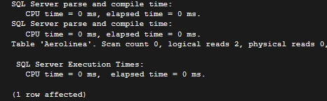
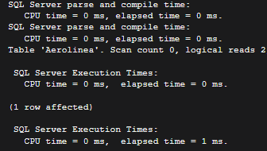

# Tema: Procedimientos y funciones almacenadas

> Script del tema: [tema02_script.sql](tema02_script.sql)

## Tareas: 

    -Realizar al menos tres procedimientos almacenados que permitan: Insertar, Modificar y borrar registros de alguna de las tablas del proyecto.
    -Insertar un lote de datos en las tablas mencionadas (guardar el script) con sentencias insert y otro lote invocando a los procedimientos creados. 
    -Realizar  update y delete sobre  algunos de los registros insertados en esas tablas invocando a los procedimientos. 
    -Desarrollar al menos tres funciones almacenadas. Por ej: calcular la edad 
    -Comparar la eficiencia de las operaciones directas versus el uso de procedimientos y funciones.

## Procedimientos Almacenados:
### 1) Se crean 3 procedimientos almacenados para la tabla Aerolinea:

**Procedimiento para ingresar datos:**
```
--Procedmiento  INSERT INTO en la tabla Aerolinea
-- =============================================
-- Nombre de Procedimiento: InsertIntoAerolinea
-- Descripción: Ingresa un registro a la tabla Aerolinea
-- Parametros:
--   @id INT - id de la aerolinea (clave primaria)
--   @nombre NVARCHAR(100) - nombre de la Aerolinea
-- =============================================
CREATE PROCEDURE InsertIntoAerolinea
  @Id	  INT,
  @nombre NVARCHAR(100)
AS
BEGIN
INSERT INTO Aerolinea(id_aerolinea, nombre)
VALUES(@Id, @nombre)
END
GO
```
**Procedimiento para modificar datos:**

```
-- =============================================
-- Nombre de Procedimiento: UpdateIntoAerolinea
-- Descripción: Modifica un registro en la tabla Aerolinea
-- Parametros:
--   @id INT - id de la aerolinea (clave primaria)
--   @nombre NVARCHAR(100) - nombre de la Aerolinea
-- =============================================
CREATE PROCEDURE UpdateAerolinea
  @Id	  INT,
  @nombre NVARCHAR(100)
AS
BEGIN
UPDATE Aerolinea
SET
	nombre=@nombre
WHERE id_aerolinea=@Id
END
GO
```
**Procedimiento para eliminar datos:**
```
-- =============================================
-- Nombre de Procedimiento: DeleteAerolinea
-- Descripción: Elimina un registro en la tabla Aerolinea
-- Parametros:
--   @id INT - id de la aerolinea (clave primaria)
-- =============================================
CREATE PROCEDURE DeleteAerolinea
  @Id INT
AS
BEGIN
DELETE FROM Aerolinea
WHERE id_aerolinea=@Id
END
GO
```

### 2) Se inserta 10 registros en la tabla Aerolinea con la sentencia `INSERT INTO` y otros 10 que usan el procedimiento almacenados `InsertIntoAerolinea`
**Ejemplo con `INSERT INTO`:**
```
INSERT INTO Aerolinea(id_aerolinea, nombre)
VALUES(19, 'American Airlines');
```
**Ejemplo con `InsertIntoAerolinea`:**
```
EXEC InsertIntoAerolinea
	 @Id=29,
	 @nombre='American Airlines';
```
### 3) Se modifica 3 registros ingresados anteriormente y se eliminan 3 utilizando los procedimientos almacenados `UpdateAerolinea` y `DeleteAerolinea`
**Ejemplo con `UpdateAerolinea`:**
```
EXEC UpdateAerolinea
	 @Id=36,
	 @nombre='Azul Brazilian';
GO
```
**Ejemplo con `DeleteAerolinea`:**
```
EXEC DeleteAerolinea
	 @id=30;
GO
```

## Funciones almacenadas:

### 4) Se crean 3 funciones almacenadas:
**Funcion que busca pasajeros con el apellido pasado como parametro:**
```
----------------------------------
-- =============================================
-- Nombre de Funcion: ApellidoPasajero
-- Descripción: Busca en la tabla Pasajero el apellido pasado como parametro.
-- Parametros:
--   @apellido NVARCHAR(100) - apellido del pasajero
-- Retorno:
--   Pasajeros que tengan como apellido el parametro @apellido
-- =============================================
CREATE FUNCTION ApellidoPasajero
(
  @apellido NVARCHAR(100)
)
RETURNS TABLE
AS
RETURN
(
SELECT *
FROM pasajero p
WHERE p.apellido LIKE @apellido
);
GO
```
**Funcion que busca los pasajes que tenga un peso de equipaje mayor o igual al parametro:**
```
-- =============================================
-- Nombre de Funcion: PasajesPorPesoExtra
-- Descripción: 
--    Busca los pasajes que tengan un peso de equipaje mayor o igual
--    al parametro @PesoEquipajeExtra. Acepta valores null.
-- Parametros:
--    @PesoEquipajeExtra DECIMAL(10, 2) NULL - peso del equipaje extra
-- Retorno:
--    Pasajes cuyo equipaje extra es mayor o igual al parametro @PesoEquipajeExtra y nombre completo del pasajero.
-- =============================================
CREATE FUNCTION PasajesPorPesoExtra
(
  @PesoEquipajeExtra DECIMAL(10, 2) NULL
)
RETURNS TABLE
AS
RETURN
(
SELECT psj.id_pasaje,
	   CONCAT( p.apellido, ', ', p.nombre ) AS 'Pasajero',
	   psj.peso_equipaje_extra
FROM pasaje psj
INNER JOIN Pasajero p
	ON psj.id_pasajero=p.id_pasajero
WHERE CASE
			   WHEN @PesoEquipajeExtra = 0
			   THEN 1
			   WHEN @PesoEquipajeExtra IS NULL
			   THEN 1
			   WHEN @PesoEquipajeExtra < 0
			   THEN 0
			   WHEN peso_equipaje_extra >= @PesoEquipajeExtra
			   THEN 1
			   ELSE 0
	  END = 1
);
GO
```
**Funcion que devuelve el costo total de los pasajes:**
```
-- =============================================
-- Nombre de Funcion: CostoPasaje
-- Descripción: 
--	 Calcula el costo total de los pasajes.
-- Parametros:
-- Retorno:
--   Pasajes, su costo total y nombre completo del pasajero
-- =============================================
CREATE FUNCTION CostoPasaje
(
)
RETURNS TABLE
AS
RETURN
(
SELECT pv.id_pasaje,
	   SUM( c.tarifa_por_km*v.distancia_km+c.tarifa_base ) AS [Costo Total],
	   CONCAT( p.apellido, ', ', p.nombre ) AS [Nombre completo de pasajero]
FROM pasaje_vuelo pv
INNER JOIN Asiento a
	ON pv.id_avion=a.id_avion
	   AND pv.nro_asiento=a.nro_asiento
INNER JOIN Clase c
	ON a.id_clase=c.id_clase
INNER JOIN Vuelo v
	ON pv.id_vuelo=v.id_vuelo
INNER JOIN Pasaje p1
	ON pv.id_pasaje=p1.id_pasaje
INNER JOIN Pasajero p
	ON p1.id_pasajero=p.id_pasajero
GROUP BY pv.id_pasaje,
		 CONCAT( p.apellido, ', ', p.nombre )
)
GO
```

### 5) Comparar la eficiencia de las operaciones directas versus el uso de procedimientos y funciones:
**Operacion sin función:**
```
SELECT *
FROM pasajero p
WHERE p.apellido LIKE 'C%'
```


**Usando función:**
```
SELECT *
FROM dbo.ApellidoPasajero( 'C%' )
GO
```


**Operacion sin procedimiento:**
```
INSERT INTO Aerolinea(id_aerolinea, nombre)
VALUES(75, 'KLM Royal Dutch Airlines');
```


**Usando procedimiento:**
```
EXEC InsertIntoAerolinea
	 @Id=76,
	 @nombre='Azul Brazilian';
GO
```
